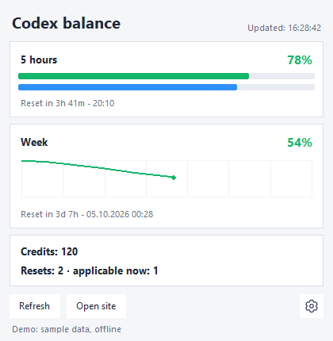

# Codex Balance Widget

[Русский](README.ru.md)

A Windows desktop widget that keeps Codex usage limits visible while you work.
See remaining quota, reset countdowns, credits and weekly usage without opening
the usage page each time. A personal project developed with AI assistance.



*Actual application UI with synthetic demo data. No account information is shown.*

## Features

- Remaining 5-hour and weekly quota, reset countdowns, credits and available resets.
- Color-coded system tray icon with exact values in its tooltip.
- Weekly usage history and a local burndown chart.
- English and Russian UI, always-on-top mode and configurable refresh interval.
- JSON usage fetching with one retry for transient errors and a Chrome fallback.
- Offline demo for trying the interface without a ChatGPT account.

## Quick start (Windows)

Install Python 3.10+ with Tkinter and Windows Python Launcher (`py`).
Clone this repository or download and extract its ZIP, then:

1. Double-click `install.bat` to install Python dependencies.
2. Double-click `run.bat` to launch the widget.
3. For live data, use an existing Codex CLI login or sign in to ChatGPT in
   the dedicated Chrome window when prompted.

All project code, including `usage_widget_common`, is included in this repository.
No sibling repositories or private packages are required. Google Chrome is needed
for the browser fallback; Playwright Chromium is not downloaded.

To preview the interface **without login or network requests**, run from the
repository directory after installation:

```bat
py -3 demo.py
```

The demo uses synthetic data, disables the tray and browser actions, and stores
its settings in a temporary folder. Closing it exits the demo.
Use `py -3 demo.py --language ru` for the Russian preview.

For normal startup with a console:

```bat
py -3 codex_balance_widget_chrome.py
```

## How it works

The app first tries the ChatGPT usage JSON endpoint using the existing access
token from `$CODEX_HOME/auth.json` (default: `~/.codex/auth.json`). It does not
refresh that token. If JSON fetching fails, it reads the visible usage page in
Google Chrome using a separate local browser profile. If neither source succeeds,
it keeps the last available values and displays a status message.

- `codex_balance_widget_chrome.py`: Tkinter UI, tray, Chrome fallback and local history.
- `json_usage_provider.py`: asynchronous JSON provider.
- `probe_wham_usage.py`: HTTP client, response parsing and redacted diagnostics.
- `usage_widget_common/`: bundled retry, error, redaction and source-selection helpers.
- `demo.py`: offline preview using the same UI as the live application.

## Tray and settings

The tray icon reflects remaining quota: green at 51–100%, orange at 21–50%,
red at 0–20%, and gray before data is available. It normally shows the tens
digit (`87%` → `8`, `100%` → `✓`). An exhausted weekly quota also blocks the
5-hour allowance and is reflected in the display.

Right-click the icon to show/hide the window, refresh, open the usage page,
change settings, view diagnostics or exit. Closing the normal widget window
hides it in the tray; choose **Exit** to stop the app. Without tray support,
closing the window exits. Restart after changing the interface language.

The blue bar beneath the 5-hour quota shows time remaining in its reset window.
The weekly chart appears once enough history is available.

If Chrome is not found automatically:

```bat
set CHROME_PATH=C:\Program Files\Google\Chrome\Application\chrome.exe
py -3 codex_balance_widget_chrome.py
```

## Local data and privacy

The widget uses the existing Codex login or its own `codex_chrome_profile/`;
it does not use your primary Chrome profile. Credentials are used locally for
requests to ChatGPT, and are not intended to appear in logs or diagnostic output.
Do not share the Chrome profile, Codex `auth.json`, or a ZIP of your working folder.
Use GitHub's source ZIP to share the published project.

Browser sessions, settings, usage history, logs, lock files and local audit
artifacts are excluded by `.gitignore`. Screenshots in this README contain only
synthetic data. See [publication checks](docs/publication-checks.md) for the
scope and limitations of the pre-publication audit.

## Development and tests

```bat
py -3 -m pip install -r requirements-dev.txt
py -3 -m pytest -q
```

Tests cover parsing, retry/error handling, fallback decisions, redaction,
countdowns and importing from a standalone copy. They do not require a live
account. GitHub Actions runs the suite on Windows.

To regenerate a screenshot of only the demo window (requires Pillow 11.2.1+):

```bat
py -3 demo.py --screenshot docs/images/widget-demo.png
```

## Limitations

Windows only. This is an unofficial project, not affiliated with OpenAI.
The usage endpoint and page layout can change without notice; either integration
may need maintenance. Live usage requires a supported ChatGPT account/session.
Automated tests and the offline demo do not prove that live authentication works
for every account. Diagnostics and the launch log are available from the settings menu.

## License

[MIT License](LICENSE)
