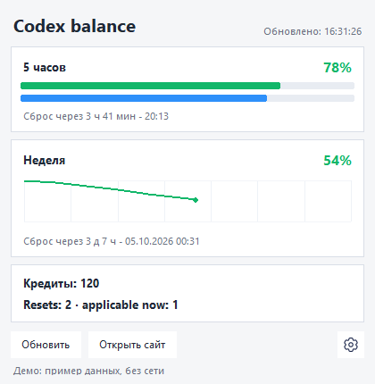

# Codex Balance Widget

[English](README.md)

Windows-виджет, который показывает лимиты Codex во время работы: остаток квоты,
время до сброса, кредиты и график расхода за неделю. Не нужно каждый раз открывать
страницу использования. Личный проект, разработанный с использованием AI.



*Скриншот настоящего интерфейса с вымышленными данными. Данных аккаунта на нём нет.*

## Возможности

- Остаток 5-часового и недельного лимитов, время до сброса, кредиты и доступные resets.
- Цветная иконка в системном трее с точными значениями в подсказке.
- Локальная история и недельный график расхода.
- Русский и английский интерфейс, режим поверх окон и настройка частоты обновления.
- Получение JSON с одной повторной попыткой при временных ошибках и резервным чтением через Chrome.
- Демо без подключения к аккаунту и без сетевых запросов.

## Установка и запуск (Windows)

Нужен Python 3.10+ с Tkinter и Windows Python Launcher (`py`).
Склонируйте репозиторий или скачайте и распакуйте ZIP с GitHub, затем:

1. Запустите `install.bat` для установки Python-зависимостей.
2. Запустите `run.bat` для запуска виджета.
3. Для настоящих данных используйте существующий вход в Codex CLI или войдите
   в ChatGPT в отдельном окне Chrome, когда виджет предложит это сделать.

Весь код, включая `usage_widget_common`, находится в этом репозитории.
Соседние репозитории и приватные пакеты не нужны. Google Chrome необходим для
резервного чтения страницы; отдельный Playwright Chromium не скачивается.

Чтобы посмотреть интерфейс **без входа в аккаунт и без сети**, после установки
выполните в папке проекта:

```bat
py -3 demo.py --language ru
```

Демо использует вымышленные данные, отключает трей и открытие браузера, а настройки
хранит во временной папке. Закрытие окна завершает демо. Команда `py -3 demo.py`
запускает английский вариант.

Обычный запуск с консолью для диагностики:

```bat
py -3 codex_balance_widget_chrome.py
```

## Как это работает

Сначала виджет запрашивает JSON об использовании через существующий access token
из `$CODEX_HOME/auth.json` (по умолчанию `~/.codex/auth.json`). Сам виджет не обновляет
токен. Если запрос не удался, он читает видимый текст страницы использования
через Google Chrome с отдельным локальным профилем. Если оба источника недоступны,
виджет сохраняет последние доступные значения и показывает сообщение о состоянии.

- `codex_balance_widget_chrome.py`: интерфейс Tkinter, трей, Chrome и локальная история.
- `json_usage_provider.py`: асинхронный источник JSON.
- `probe_wham_usage.py`: HTTP-запрос, разбор ответа и диагностика с удалением чувствительных полей.
- `usage_widget_common/`: включённые в проект обработка ошибок, повторные попытки, очистка данных и выбор источника.
- `demo.py`: автономное демо с тем же интерфейсом, что и у основного приложения.

## Трей и настройки

Цвет иконки отражает остаток: зелёный — 51–100%, оранжевый — 21–50%, красный — 0–20%,
серый — данные ещё не загружены. Обычно на иконке показана цифра десятков:
`87%` → `8`, `100%` → `✓`. Исчерпание недельной квоты также блокирует 5-часовой
лимит и учитывается при отображении.

В меню по правой кнопке доступны показ/скрытие окна, обновление, страница использования,
настройки, диагностика и выход. Крестик обычного виджета скрывает окно в трей;
для завершения выберите **Выход**. Если трей недоступен, крестик завершает приложение.
После смены языка перезапустите виджет.

Синяя полоска под 5-часовым лимитом показывает оставшееся время его окна сброса.
Недельный график появляется после накопления истории.

Если Chrome не найден автоматически:

```bat
set CHROME_PATH=C:\Program Files\Google\Chrome\Application\chrome.exe
py -3 codex_balance_widget_chrome.py
```

## Локальные данные

Виджет использует существующий вход в Codex или собственный `codex_chrome_profile/`.
Основной профиль Chrome не используется. Данные авторизации используются локально
для запросов к ChatGPT и не должны попадать в логи и диагностический вывод.
Не передавайте другим профиль браузера, Codex `auth.json` или архив рабочей папки.
Для передачи опубликованного кода используйте ZIP с GitHub.

Сессии браузера, настройки, история расхода, логи, lock-файлы и локальные отчёты
проверок исключены через `.gitignore`. Скриншоты содержат только вымышленные данные.
Объём проверки перед публикацией и её ограничения описаны в
[отчёте](docs/publication-checks.md).

## Разработка и тесты

```bat
py -3 -m pip install -r requirements-dev.txt
py -3 -m pytest -q
```

Тесты проверяют разбор данных, повторные запросы и ошибки, выбор резервного источника,
удаление чувствительных полей, отсчёт времени и импорт из автономной копии.
Настоящий аккаунт не требуется. GitHub Actions запускает тесты на Windows.

Для нового скриншота только демонстрационного окна нужен Pillow 11.2.1+:

```bat
py -3 demo.py --language ru --screenshot docs/images/widget-demo-ru.png
```

## Ограничения

Только Windows. Неофициальный проект, не связанный с OpenAI. Endpoint и страница
использования могут измениться, и интеграции потребуется обновление. Для настоящих
данных нужен поддерживаемый аккаунт и сессия ChatGPT. Автотесты и демо не подтверждают
работу авторизации для любого аккаунта. Диагностика и лог запуска доступны из меню настроек.

## Лицензия

[MIT License](LICENSE)
